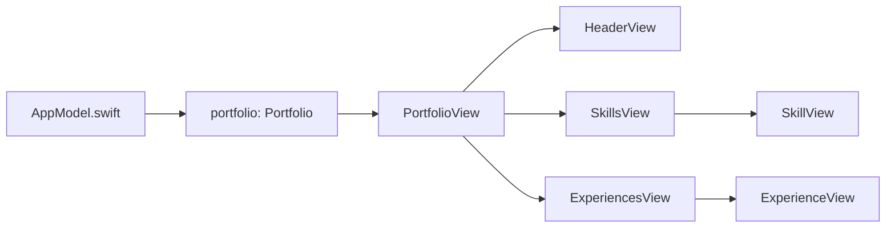

## Overview

The OI Resume App uses a centralized state management approach with the `AppModel` class. This class serves as the single source of truth for portfolio data and conforms to SwiftUI's `ObservableObject` protocol for reactive updates.

<Note>
While `AppModel` is declared as an `ObservableObject`, the current implementation uses static data and doesn't leverage the reactive publishing capabilities. This design allows for future enhancements with dynamic data.
</Note>

## AppModel class

The central state management class defined in `Code/Services/AppModel.swift`.

### Implementation

```swift Code/Services/AppModel.swift
class AppModel: ObservableObject {
    var portfolio: Portfolio = Portfolio(
        name: "Olawale Ibitoye",
        role: "QA Engineer",
        description: "Experienced Tester with a profound passion for Technology.",
        linkedin: "olawale-ibitoye",
        github: "olaeben",
        location: "United Kingdom",
        skills: [
            Skill(id: UUID().uuidString, skillName: "Mobile", image: "iphone"),
            Skill(id: UUID().uuidString, skillName: "API", image: "laptopcomputer"),
            Skill(id: UUID().uuidString, skillName: "Accessibility", image: "accessibility"),
            Skill(id: UUID().uuidString, skillName: "Automation", image: "dot.scope.laptopcomputer"),
            Skill(id: UUID().uuidString, skillName: "Database", image: "square.stack.3d.up.badge.automatic.fill"),
            Skill(id: UUID().uuidString, skillName: "CI/CD", image: "infinity")
        ],
        experience: [
            Experience(id: UUID().uuidString, companyName: "INIT Creative", role: "AI Specialist", duration: "July 2024 - Present"),
            Experience(id: UUID().uuidString, companyName: "Digivante", role: "Freelance Tester", duration: "Jan 2023 - Present"),
            Experience(id: UUID().uuidString, companyName: "Vertex", role: "QA Engineer", duration: "Apr 2022 - Dec 2022"),
            Experience(id: UUID().uuidString, companyName: "Renmoney", role: "QA Engineer", duration: "Jun 2021 - Apr 2022"),
            Experience(id: UUID().uuidString, companyName: "RGS", role: "Software Tester", duration: "Sept 2019 - Jun 2021")
        ]
    )
}
```

## Architecture pattern

### Current implementation

The app uses a simplified state management pattern:

<Tabs>
  <Tab title="Static data">
    Portfolio data is hardcoded in the AppModel initializer:
    
    ```swift
    var portfolio: Portfolio = Portfolio(...)
    ```
    
    This approach is suitable for:
    - Simple, static content
    - Single-user portfolios
    - Apps without backend integration
  </Tab>

  <Tab title="ObservableObject">
    Declared but not fully utilized:
    
    ```swift
    class AppModel: ObservableObject {
        var portfolio: Portfolio = ...
    }
    ```
    
    To enable reactivity, add `@Published`:
    
    ```swift
    class AppModel: ObservableObject {
        @Published var portfolio: Portfolio = ...
    }
    ```
  </Tab>

  <Tab title="View integration">
    Views create their own AppModel instance:
    
    ```swift
    struct PortfolioView: View {
        var appModel: AppModel = AppModel()
        ...
    }
    ```
  </Tab>
</Tabs>

### Data flow diagram



## Data structure

The `AppModel` contains a single `Portfolio` instance with nested collections:

<Steps>
  <Step title="Personal information">
    Name, role, description, location, and social links
  </Step>
  <Step title="Skills array">
    6 professional skills with icons (Mobile, API, Accessibility, Automation, Database, CI/CD)
  </Step>
  <Step title="Experience array">
    5 work experience entries in reverse chronological order
  </Step>
</Steps>

### Portfolio data

<ParamField path="name" type="String" default="Olawale Ibitoye">
  Portfolio owner's full name
</ParamField>

<ParamField path="role" type="String" default="QA Engineer">
  Current professional role
</ParamField>

<ParamField path="description" type="String" default="Experienced Tester with a profound passion for Technology.">
  Professional summary
</ParamField>

<ParamField path="linkedin" type="String" default="olawale-ibitoye">
  LinkedIn username
</ParamField>

<ParamField path="github" type="String" default="olaeben">
  GitHub username
</ParamField>

<ParamField path="location" type="String" default="United Kingdom">
  Current location
</ParamField>

### Skills collection

<CodeGroup>

```swift Mobile
Skill(id: UUID().uuidString, skillName: "Mobile", image: "iphone")
```

```swift API
Skill(id: UUID().uuidString, skillName: "API", image: "laptopcomputer")
```

```swift Accessibility
Skill(id: UUID().uuidString, skillName: "Accessibility", image: "accessibility")
```

```swift Automation
Skill(id: UUID().uuidString, skillName: "Automation", image: "dot.scope.laptopcomputer")
```

```swift Database
Skill(id: UUID().uuidString, skillName: "Database", image: "square.stack.3d.up.badge.automatic.fill")
```

```swift CI/CD
Skill(id: UUID().uuidString, skillName: "CI/CD", image: "infinity")
```

</CodeGroup>

### Experience timeline

<AccordionGroup>
  <Accordion title="Current positions (2)">
    - **INIT Creative**: AI Specialist (July 2024 - Present)
    - **Digivante**: Freelance Tester (Jan 2023 - Present)
  </Accordion>

  <Accordion title="Previous positions (3)">
    - **Vertex**: QA Engineer (Apr 2022 - Dec 2022)
    - **Renmoney**: QA Engineer (Jun 2021 - Apr 2022)
    - **RGS**: Software Tester (Sept 2019 - Jun 2021)
  </Accordion>
</AccordionGroup>

## State management best practices

### Current approach

The app uses a straightforward pattern suitable for its scope:

<Tabs>
  <Tab title="Advantages">
    - Simple to understand and maintain
    - No external dependencies
    - Fast initialization
    - Predictable data flow
    - Minimal boilerplate code
  </Tab>

  <Tab title="Limitations">
    - Data is hardcoded
    - Cannot update dynamically
    - New instance per view
    - No persistence
    - Not suitable for multi-screen apps
  </Tab>
</Tabs>

### Alternative approaches

For more complex requirements, consider these patterns:

<AccordionGroup>
  <Accordion title="@StateObject + @ObservedObject">
    Share a single AppModel instance across views:
    
    ```swift
    struct PortfolioView: View {
        @StateObject private var appModel = AppModel()
        
        var body: some View {
            HeaderView()
                .environmentObject(appModel)
        }
    }
    
    struct HeaderView: View {
        @EnvironmentObject var appModel: AppModel
        // ...
    }
    ```
    
    **Benefits**: Single source of truth, automatic view updates
  </Accordion>

  <Accordion title="Environment injection">
    Inject AppModel into the environment:
    
    ```swift
    @main
    struct OI_PortfolioApp: App {
        @StateObject private var appModel = AppModel()
        
        var body: some Scene {
            WindowGroup {
                PortfolioView()
                    .environmentObject(appModel)
            }
        }
    }
    ```
    
    **Benefits**: Available throughout view hierarchy without explicit passing
  </Accordion>

  <Accordion title="Async data loading">
    Load portfolio from API or local storage:
    
    ```swift
    class AppModel: ObservableObject {
        @Published var portfolio: Portfolio?
        @Published var isLoading = false
        
        func loadPortfolio() async {
            isLoading = true
            portfolio = try? await fetchPortfolioFromAPI()
            isLoading = false
        }
    }
    ```
    
    **Benefits**: Supports dynamic content, offline mode, user customization
  </Accordion>
</AccordionGroup>

## Enhancement opportunities

<CardGroup cols={2}>
  <Card title="Dynamic data loading" icon="cloud-arrow-down">
    Fetch portfolio data from an API or Firebase backend
  </Card>
  
  <Card title="Local persistence" icon="floppy-disk">
    Save portfolio data using UserDefaults or Core Data
  </Card>
  
  <Card title="Edit mode" icon="pen-to-square">
    Allow users to update their portfolio information
  </Card>
  
  <Card title="Multiple portfolios" icon="users">
    Support viewing different user profiles
  </Card>
  
  <Card title="Export functionality" icon="file-export">
    Generate PDF or share portfolio as formatted document
  </Card>
  
  <Card title="Analytics tracking" icon="chart-line">
    Track portfolio views and interactions
  </Card>
</CardGroup>

## Migration guide

### Adding reactive updates

To enable reactive data binding:

<Steps>
  <Step title="Mark property as @Published">
    ```swift
    class AppModel: ObservableObject {
        @Published var portfolio: Portfolio = ...
    }
    ```
  </Step>

  <Step title="Use @StateObject in root view">
    ```swift
    struct PortfolioView: View {
        @StateObject private var appModel = AppModel()
        // ...
    }
    ```
  </Step>

  <Step title="Pass via environment or property">
    ```swift
    // Option 1: Environment
    HeaderView().environmentObject(appModel)
    
    // Option 2: Property
    HeaderView(appModel: appModel)
    ```
  </Step>

  <Step title="Update views to observe changes">
    ```swift
    struct HeaderView: View {
        @ObservedObject var appModel: AppModel
        // or
        @EnvironmentObject var appModel: AppModel
    }
    ```
  </Step>
</Steps>

<Warning>
When migrating to reactive state management, ensure all views observing AppModel use `@ObservedObject` or `@EnvironmentObject` to receive updates.
</Warning>

### Adding data persistence

To load portfolio from JSON file:

<CodeGroup>

```swift AppModel with persistence
class AppModel: ObservableObject {
    @Published var portfolio: Portfolio
    
    init() {
        if let data = UserDefaults.standard.data(forKey: "portfolio"),
           let decoded = try? JSONDecoder().decode(Portfolio.self, from: data) {
            self.portfolio = decoded
        } else {
            // Load default portfolio
            self.portfolio = AppModel.defaultPortfolio()
        }
    }
    
    func savePortfolio() {
        if let encoded = try? JSONEncoder().encode(portfolio) {
            UserDefaults.standard.set(encoded, forKey: "portfolio")
        }
    }
    
    static func defaultPortfolio() -> Portfolio {
        // Return hardcoded portfolio as fallback
    }
}
```

```swift Portfolio.swift with Codable
struct Portfolio: Codable {
    let name: String
    let role: String
    // ...
}

struct Skill: Identifiable, Codable {
    var id: String
    let skillName: String
    let image: String
}

struct Experience: Identifiable, Codable {
    var id: String
    let companyName: String
    let role: String
    let duration: String
}
```

</CodeGroup>

## Testing considerations

### Mock data

Create a mock AppModel for testing:

```swift
extension AppModel {
    static var preview: AppModel {
        let model = AppModel()
        // Optionally override with test data
        return model
    }
}

struct HeaderView_Previews: PreviewProvider {
    static var previews: some View {
        HeaderView(appModel: .preview)
            .padding(24)
    }
}
```

### Dependency injection

For testability, inject AppModel as a protocol:

```swift
protocol PortfolioProvider {
    var portfolio: Portfolio { get }
}

class AppModel: ObservableObject, PortfolioProvider {
    var portfolio: Portfolio = ...
}

class MockAppModel: PortfolioProvider {
    var portfolio: Portfolio = ... // Test data
}
```

## Related documentation

<CardGroup cols={2}>
  <Card title="Data models" icon="database" href="/architecture/data-models">
    Learn about Portfolio, Skill, and Experience structures
  </Card>
  <Card title="Views" icon="window" href="/architecture/views">
    See how views consume AppModel data
  </Card>
</CardGroup>