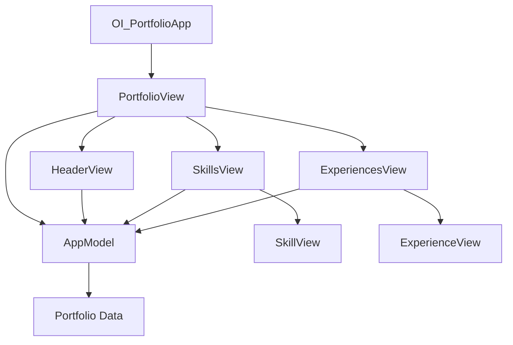

## Introduction

The OI Resume App is a native iOS application built with SwiftUI that displays professional portfolio information including skills, work experience, and contact details. The app follows a clean, modular architecture with clear separation of concerns between data models, business logic, and presentation layers.

## Architecture layers

The application is organized into three primary architectural layers:

<CardGroup cols={3}>
  <Card title="Models" icon="database">
    Data structures representing portfolio information
  </Card>
  <Card title="Services" icon="gear">
    Business logic and app state management
  </Card>
  <Card title="Views" icon="eye">
    SwiftUI-based user interface components
  </Card>
</CardGroup>

## Project structure

The codebase is organized into the following directories:

```
OI_Portfolio/
├── Code/
│   ├── Controllers/
│   │   └── OI_PortfolioApp.swift      # App entry point
│   ├── Models/
│   │   └── Portfolio.swift             # Data models
│   ├── Services/
│   │   └── AppModel.swift              # App state management
│   └── Views/
│       ├── PortfolioView.swift         # Main view
│       └── SupportViews/               # Reusable components
│           ├── HeaderView.swift
│           ├── SkillsView.swift
│           ├── SkillView.swift
│           ├── ExperiencesView.swift
│           └── ExperienceView.swift
├── Extensions/
│   └── ColorExtensions.swift           # Color utilities
└── Utilities/
    └── FontManager.swift               # Custom fonts
```

## Key architectural patterns

### MVVM-inspired design

While not strictly adhering to MVVM, the app follows similar principles:

- **Model**: `Portfolio`, `Skill`, and `Experience` structs define the data structure
- **View Model**: `AppModel` class manages app state and data
- **View**: SwiftUI views handle presentation logic

<Note>
The app uses a simplified state management approach with `AppModel` as an `ObservableObject` for reactive data binding.
</Note>

### Component composition

The UI is built using composable SwiftUI views:

1. **Main view**: `PortfolioView` serves as the primary container
2. **Section views**: `HeaderView`, `SkillsView`, and `ExperiencesView` organize content
3. **Item views**: `SkillView` and `ExperienceView` render individual items

### Data flow



## State management

The app uses SwiftUI's native state management:

- **AppModel**: Central source of truth for portfolio data
- **@State**: Local view state (e.g., toggle states for collapsible sections)
- **Property passing**: Data flows down through view hierarchy via properties

<Tabs>
  <Tab title="App initialization">
    ```swift Code/Controllers/OI_PortfolioApp.swift
    @main
    struct OI_PortfolioApp: App {
        var body: some Scene {
            WindowGroup {
                PortfolioView()
            }
        }
    }
    ```
  </Tab>
  <Tab title="View composition">
    ```swift Code/Views/PortfolioView.swift
    struct PortfolioView: View {
        var appModel: AppModel = AppModel()
        
        var body: some View {
            ZStack {
                Color(UIColor.systemBackground)
                    .ignoresSafeArea()
                ScrollView(.vertical, showsIndicators: false) {
                    VStack(alignment: .leading) {
                        HeaderView(appModel: appModel)
                        SkillsView(skills: appModel.portfolio.skills, width: UIScreen.main.bounds.width + 5)
                            .padding(.top, 32)
                        ExperiencesView(experience: appModel.portfolio.experience)
                            .padding(.top, 42)
                    }
                    .padding(24)
                }
            }
        }
    }
    ```
  </Tab>
</Tabs>

## Design considerations

### Simplicity

The app prioritizes simplicity over complex architectural patterns:

- No external dependencies or third-party frameworks
- Minimal abstraction layers
- Straightforward data flow

### Maintainability

Code organization supports easy maintenance:

- Clear folder structure by responsibility
- Reusable view components
- Centralized data management

### Extensibility

The architecture allows for future enhancements:

- Add new data models by extending `Portfolio` struct
- Create new view components following existing patterns
- Introduce networking layer for dynamic data loading

<Note>
Currently, portfolio data is hardcoded in `AppModel`. Future versions could fetch data from an API or local database.
</Note>

## Next steps

<CardGroup cols={2}>
  <Card title="Data models" icon="box" href="/architecture/data-models">
    Learn about Portfolio, Skill, and Experience structures
  </Card>
  <Card title="App state" icon="circle-nodes" href="/architecture/app-state">
    Understand AppModel and state management
  </Card>
  <Card title="Views" icon="window" href="/architecture/views">
    Explore the SwiftUI view hierarchy
  </Card>
</CardGroup>