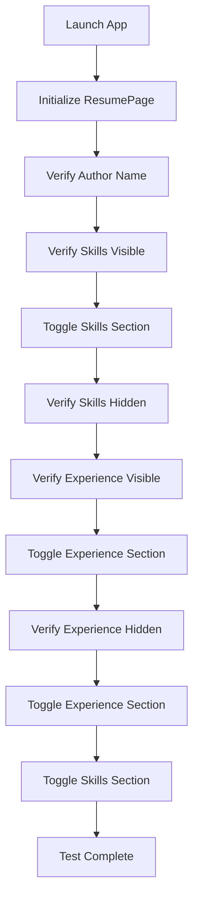

The OI Resume App test suite validates critical user interactions and UI behaviors. All tests are implemented using the Page Object Model pattern and XCUITest framework.

## Test class structure

The `OI_ResumeTests` class contains all UI test cases:

```swift OI_PortfolioUITests/OITest/OI_PortfolioUITests.swift
import XCTest
import Foundation

final class OI_ResumeTests: OIBaseTest {

    func testResumePage() throws {
        // Initialize the Page Object
        let resumePage = ResumePage(app: app)

        // Verify Author's Name
        resumePage.verifyAuthorNameExists()

        // Verify and Toggle Skills Section
        resumePage.verifySkillsVisibility(shouldExist: true)
        resumePage.toggleSkillsSection()
        resumePage.verifySkillsVisibility(shouldExist: false)

        // Verify and Toggle Experience Section
        resumePage.verifyExperienceVisibility(shouldExist: true)
        resumePage.toggleExperienceSection()
        resumePage.verifyExperienceVisibility(shouldExist: false)

        // Toggle Back the Skills and Experience Sections
        resumePage.toggleExperienceSection()
        resumePage.toggleSkillsSection()
    }
}
```

## Test case breakdown

### testResumePage()

This comprehensive test validates the core functionality of the resume screen.

<Steps>
  <Step title="Initialize page object">
    ```swift
    let resumePage = ResumePage(app: app)
    ```
    
    Creates an instance of `ResumePage` with the `XCUIApplication` from the base test class.
  </Step>
  
  <Step title="Verify author name">
    ```swift
    resumePage.verifyAuthorNameExists()
    ```
    
    Confirms that "Olawale Ibitoye" is displayed on the resume screen.
    
    <Note>
    This validates that the app launches successfully and displays the primary author information.
    </Note>
  </Step>
  
  <Step title="Test skills section collapse">
    ```swift
    resumePage.verifySkillsVisibility(shouldExist: true)
    resumePage.toggleSkillsSection()
    resumePage.verifySkillsVisibility(shouldExist: false)
    ```
    
    **Flow**:
    1. Verify skills ("Mobile") are initially visible
    2. Tap the skills chevron button to collapse the section
    3. Verify skills are no longer visible
  </Step>
  
  <Step title="Test experience section collapse">
    ```swift
    resumePage.verifyExperienceVisibility(shouldExist: true)
    resumePage.toggleExperienceSection()
    resumePage.verifyExperienceVisibility(shouldExist: false)
    ```
    
    **Flow**:
    1. Verify experience ("INIT Creative") is initially visible
    2. Tap the experience chevron button to collapse the section
    3. Verify experience is no longer visible
  </Step>
  
  <Step title="Test expand functionality">
    ```swift
    resumePage.toggleExperienceSection()
    resumePage.toggleSkillsSection()
    ```
    
    Toggles both sections back to their expanded state, verifying that the chevron buttons work bidirectionally.
  </Step>
</Steps>

## Test scenarios

<AccordionGroup>
  <Accordion title="Author name verification" icon="user">
    **Purpose**: Ensures the resume displays the correct author name
    
    **Steps**:
    1. Launch the app
    2. Locate the static text "Olawale Ibitoye"
    3. Assert that the element exists
    
    **Expected result**: The author name "Olawale Ibitoye" is visible on the screen
    
    **Code**:
    ```swift
    resumePage.verifyAuthorNameExists()
    ```
  </Accordion>
  
  <Accordion title="Skills section toggle" icon="code">
    **Purpose**: Validates the expandable/collapsible behavior of the skills section
    
    **Steps**:
    1. Verify skills are initially visible ("Mobile" text exists)
    2. Tap the first chevron button (skills chevron)
    3. Verify skills are now hidden ("Mobile" text does not exist)
    4. Tap the chevron again to expand
    
    **Expected result**: Skills section toggles between visible and hidden states
    
    **Code**:
    ```swift
    resumePage.verifySkillsVisibility(shouldExist: true)
    resumePage.toggleSkillsSection()
    resumePage.verifySkillsVisibility(shouldExist: false)
    resumePage.toggleSkillsSection()
    ```
  </Accordion>
  
  <Accordion title="Experience section toggle" icon="briefcase">
    **Purpose**: Validates the expandable/collapsible behavior of the experience section
    
    **Steps**:
    1. Verify experience is initially visible ("INIT Creative" text exists)
    2. Tap the second chevron button (experience chevron)
    3. Verify experience is now hidden ("INIT Creative" text does not exist)
    4. Tap the chevron again to expand
    
    **Expected result**: Experience section toggles between visible and hidden states
    
    **Code**:
    ```swift
    resumePage.verifyExperienceVisibility(shouldExist: true)
    resumePage.toggleExperienceSection()
    resumePage.verifyExperienceVisibility(shouldExist: false)
    resumePage.toggleExperienceSection()
    ```
  </Accordion>
  
  <Accordion title="Multiple section interaction" icon="layer-group">
    **Purpose**: Ensures multiple sections can be toggled independently
    
    **Steps**:
    1. Collapse skills section
    2. Collapse experience section
    3. Verify both sections are collapsed
    4. Expand both sections
    
    **Expected result**: Sections maintain independent state and can be toggled in any order
  </Accordion>
</AccordionGroup>

## Assertions used

The test suite uses XCTest assertions to validate behavior:

<CodeGroup>
```swift Element existence
XCTAssertTrue(authorName.exists, "The author's name should exist")
XCTAssertTrue(skillsChevronButton.exists, "The skills chevron button should exist")
```

```swift Element visibility (positive)
XCTAssertTrue(mobileText.exists, "The mobile and other skills should be visible")
XCTAssertTrue(jobText.exists, "Creative and other experiences should be visible")
```

```swift Element visibility (negative)
XCTAssertFalse(mobileText.exists, "The mobile and other skills should not be visible")
XCTAssertFalse(jobText.exists, "Creative and other experiences should not be visible")
```
</CodeGroup>

<Tip>
All assertions include descriptive messages that make test failures easy to understand and debug.
</Tip>

## Test flow diagram



## Test inheritance

The test class inherits from `OIBaseTest`:

```swift
final class OI_ResumeTests: OIBaseTest {
    // Tests inherit app setup and teardown
}
```

This provides:
- Automatic app launch before each test
- Access to the `XCUIApplication` instance via `app`
- Automatic app termination after each test
- `continueAfterFailure = false` configuration

<Check>
Inheriting from `OIBaseTest` ensures consistent test environment setup and cleanup across all test cases.
</Check>

## Code coverage

The current test suite provides coverage for:

| Feature | Coverage |
|---------|----------|
| Author name display | ✅ Full |
| Skills section toggle | ✅ Full |
| Experience section toggle | ✅ Full |
| Chevron button interaction | ✅ Full |
| UI element visibility | ✅ Full |
| Multiple section interaction | ✅ Full |

## Extending the test suite

To add new test cases:

<Steps>
  <Step title="Add test method">
    Create a new method in `OI_ResumeTests` with the `test` prefix:
    
    ```swift
    func testNewFeature() throws {
        let resumePage = ResumePage(app: app)
        // Test logic here
    }
    ```
  </Step>
  
  <Step title="Update page object if needed">
    Add new elements or actions to `ResumePage` if testing new UI components:
    
    ```swift
    var newElement: XCUIElement {
        return app.staticTexts["New Element"]
    }
    
    func verifyNewElement() {
        XCTAssertTrue(newElement.exists)
    }
    ```
  </Step>
  
  <Step title="Follow naming conventions">
    - Test methods: `testFeatureName()`
    - Use descriptive names that explain what is being tested
    - Include clear assertion messages
  </Step>
</Steps>

<Warning>
All test methods must start with the word "test" for XCTest to automatically discover and run them.
</Warning>

## Next steps

<Card title="Running tests" icon="play" href="/testing/running-tests">
  Learn how to execute these tests in Xcode and interpret the results
</Card>
